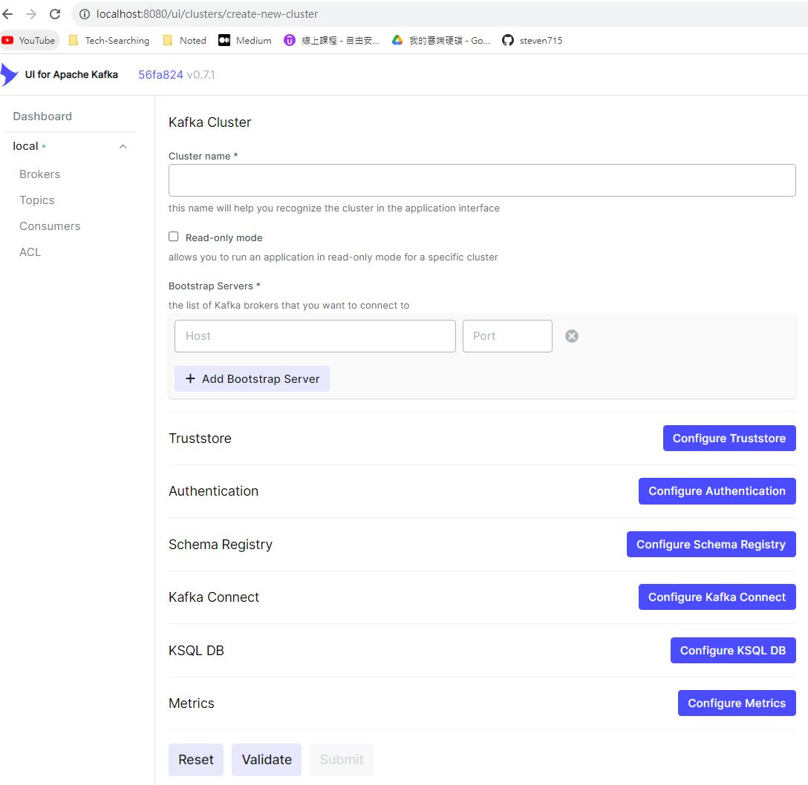

# 第三方套件 librdkafka

今天來介紹`kafka`的客戶端函式庫，`kafka`是個提供高效一致性的消息隊列平台。

## 環境

環境需要建立一個kafka的環境(使用`docker-compose`)跟我們的開發環境以及配一個[kafka-ui](https://github.com/provectus/kafka-ui)工具

```docker-compose
# docker-compose.yaml
version: '3'

services:
  zookeeper:
    image: zookeeper
    restart: unless-stopped
    ports:
      - "2181:2181"
    volumes:
      - /usr/local/zookeeper/data:/data
      - /usr/local/zookeeper/log:/datalog
    container_name: zookeeper

  kafka:
    image: wurstmeister/kafka
    ports:
      - "9092:9092"
    environment:
      KAFKA_ADVERTISED_HOST_NAME: "172.31.224.1"
      KAFKA_ZOOKEEPER_CONNECT: "zookeeper:2181"
      KAFKA_LOG_DIRS: "/kafka/kafka-logs-1"
    volumes:
      - /usr/local/kafka/logs:/kafka/kafka-logs-1
    depends_on:
      - zookeeper
    container_name: kafka
```

透過以下指令分別啟需要的容器起來

```shell
docker run -v D:/dvt:/home --name=cpp_dev --tty cpp_dev
docker-compose up -d 
docker run -itd -p 8080:8080 -e DYNAMIC_CONFIG_ENABLED=true provectuslabs/kafka-ui
```



## 安裝

安裝一樣透過`vcpkg`

```shell
vcpkg install librdkafka
# 安裝完成信息
The package librdkafka:x64-linux provides CMake targets:

    find_package(RdKafka CONFIG REQUIRED)
    target_link_libraries(main PRIVATE RdKafka::rdkafka RdKafka::rdkafka++)
```

## 使用

這邊會需要分別建`producer.cpp`跟`consumer.cpp`，其中`producer`負責發信息，`consumer`負責接信息，代碼也是使用官方的範例，但礙於篇幅，我這邊提供我調整過後的代碼放在我的[github](https://github.com/steven715/15-IT-IronMan/tree/master/Day10)

然後再補上`CMakeLists.txt`跟`cmake -B build -S . -DCMAKE_TOOLCHAIN_FILE=/opt/vcpkg/scripts/buildsystems/vcpkg.cmake`

```cmake
cmake_minimum_required(VERSION 3.10) # 設定最低版本要求
project(cmaketest)                  # 專案名稱

set(CMAKE_CXX_FLAGS "-std=c++14 -fpermissive")  # -fpermissive 忽略編譯警告

set(SRC_producer
    producer.cpp
)

set(SRC_consumer
    consumer.cpp
)

find_package(RdKafka CONFIG REQUIRED)

add_executable(producer ${SRC_producer})
add_executable(consumer ${SRC_consumer})

target_link_libraries(producer PRIVATE RdKafka::rdkafka RdKafka::rdkafka++)
target_link_libraries(consumer PRIVATE RdKafka::rdkafka RdKafka::rdkafka++)
```

接者就是編譯跟使用的時候，注意這時候就需要開兩個`terminal`來做DEMO，最後也能透過`kafka-ui`看到我們剛剛的信息

```shell
# producer
cd build
make
./producer 172.31.224.1:9092 test # 第一個參數是kafka的ip及port，第二個是topic name可隨意取
% Type message value and hit enter to produce message.
hello # 隨意打點字然後Enter
% Enqueued message (5 bytes) for topic test
nice # 隨意打點字然後Enter
% Enqueued message (4 bytes) for topic test
% Message delivered to topic test [0] at offset 0
^Cexit # 結束用exit
% Enqueued message (4 bytes) for topic test
% Message delivered to topic test [0] at offset 1
% Flushing final messages...
% Message delivered to topic test [0] at offset 2
```

```shell
# consumer
cd build
./consumer 172.31.224.1:9092 0 test # 第一個參數是kafka的ip及port，第二個是group id，這個先填0即可，第三個一樣是topic，就跟producer的一樣
% Subscribed to 1 topic(s), waiting for rebalance and messages...
% Consumer error: Subscribed topic not available: test: Broker: Unknown topic or partition
Message on test [0] at offset 0 (leader epoch 0):
 Value: hello # 收到的信息
Message on test [0] at offset 1 (leader epoch 0):
 Value: nice # 收到的信息
Message on test [0] at offset 2 (leader epoch 0):
 Value: exit # 收到的信息
^C% Closing consumer # 結束 ctrl + c
```


## 參考

[Docker - 通过容器部署Kafka环境教程（以及ZooKeeper）](https://www.hangge.com/blog/cache/detail_2791.html)
