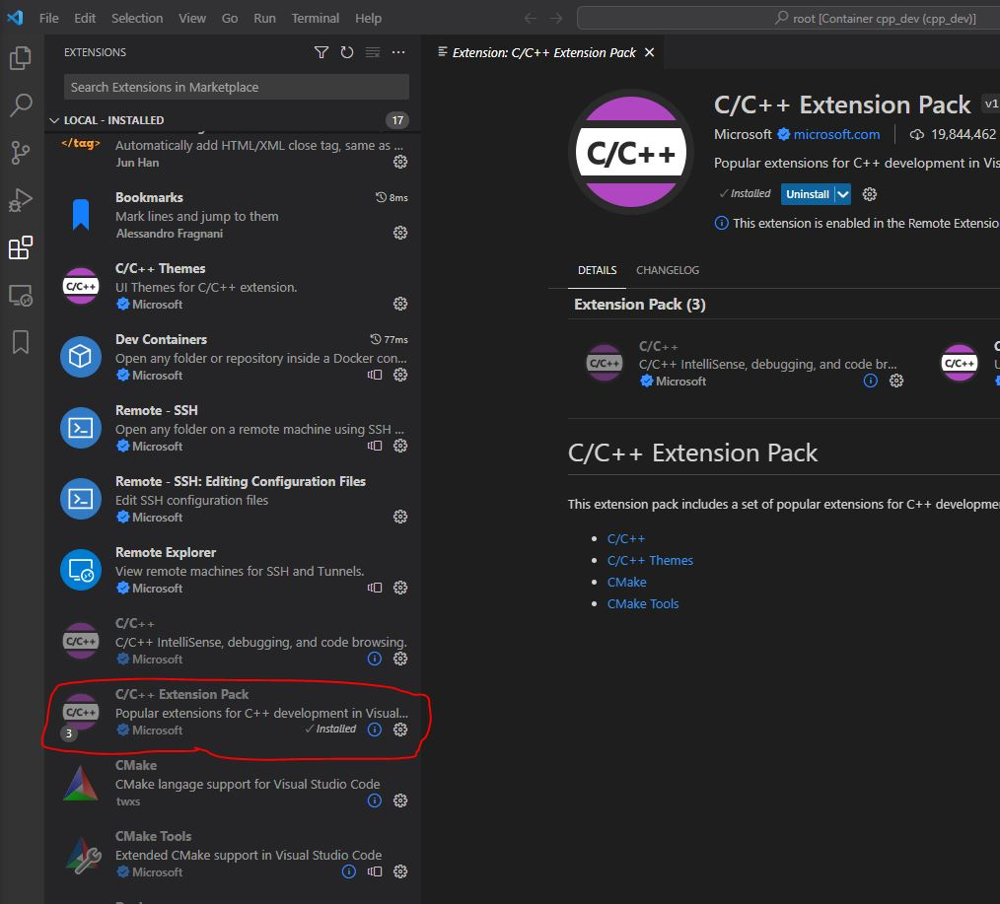
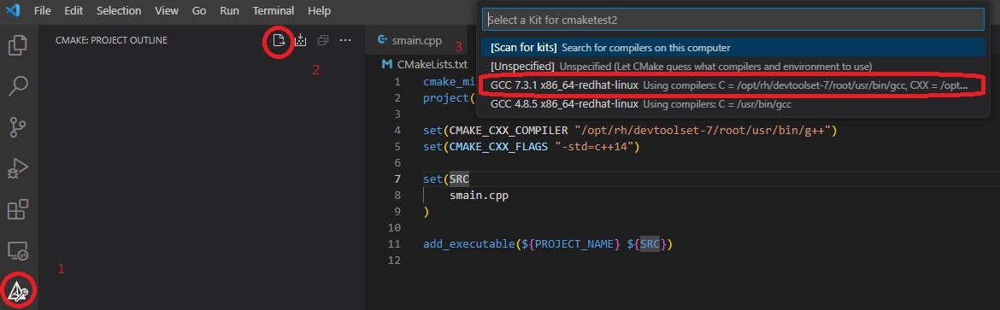
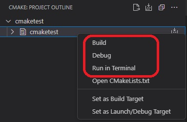
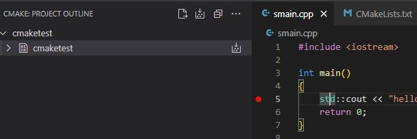
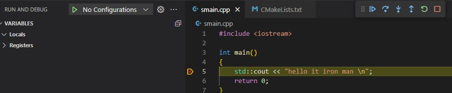
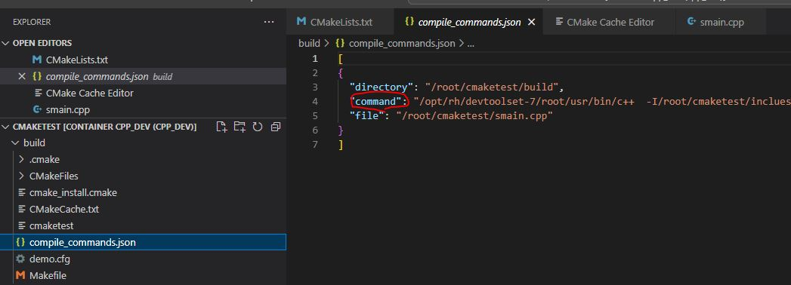
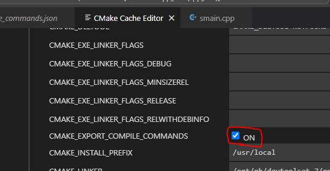

# Day 2 C++開發工具介紹2

今天延續Day 1最後的CMake專案部分，前篇CMake用`CLI`去編譯C++的專案，那今天就從`GUI`角度來編譯。

## CMake with VS Code

這邊就用昨天建出來的docker container(cpp_dev)，來演示透過VS Code套件`CMake Tools`建置專案。

如果沒有建的話也沒關係，用docker再重建一次就好，需要Dockerfile也可以從[這裡](https://github.com/steven715/15-IT-IronMan/blob/master/Day1/Dockerfile)找到。

```shell
docker build -t cpp_dev .
docker run -v D:/dvt:/home --name=cpp_dev --tty cpp_dev 
```

建好之後一樣透過`Remote - Explorer`中的`Dev Container`連進去容器內部，這邊要注意一下，剛連過去會看到VS Code的Extensions會有很多套件要重裝，這邊就重裝`C/C++ Extension Pack`就好，他會把`C/C++`跟`CMake Tools`都裝好。



接著再建一個新的資料夾當CMake專案用。

```shell
mkdir cmaketest2
cd cmaketest2
code . # 用vs code把資料夾打開
```

CMakeLists.txt跟cpp的檔案就先延續前一天的，接著就是來設定CMake專案的時候。



設定如上圖，主要有3個步驟

1. 先點左邊的CMake圖示，紅字1
2. 點`Configure All Projects`圖示，紅字2
3. 彈出的框中選GCC 7.3.1的選項，紅字3



上面設定完了後，應該就會看到上圖出現cmaketest的專案，對他點右鍵，就能透過`GUI`建置、偵錯、執行專案了。

## Debug

這邊就先講一下在VS code偵錯的部分，這次先在`smain.cpp`檔案中加入中斷點。



然後對cmaketest專案選擇`Debug`，就能進入偵錯模式了。



## CMake 常用語法

這邊常用語法主要是專案參考包含目錄、依賴庫目錄及依賴庫的設定，所以這邊先跳著介紹一下`vcpkg`。

### Vcpkg

`vcpkg`是微軟提供的免費開源C/C++套件管理工具。

```shell
# 下載vcpkg
git clone https://github.com/microsoft/vcpkg
# 編譯 vcpkg
./vcpkg/bootstrap-vcpkg.sh 
# 將vcpkg加入PATH
echo 'export PATH="/opt/vcpkg:$PATH"' >> ~/.bashrc 
# 讓配置生效
source ~/.bashrc
```

上述配置好了以後，就可以使用vcpkg來下載並使用第三方套件了，那範例就用[fmt](https://github.com/fmtlib/fmt)，一個提供格式化的C++函式庫。

```shell
# 安裝fmt
vcpkg install fmt
```

安裝完成後，vcpkg會返回以下信息，告訴我們怎麼使用。

```shell
Computing installation plan...
The following packages are already installed:
    fmt:x64-linux -> 10.1.0
fmt:x64-linux is already installed
Total install time: 50.6 us
The package fmt provides CMake targets:

    find_package(fmt CONFIG REQUIRED)
    target_link_libraries(main PRIVATE fmt::fmt)

    # Or use the header-only version
    find_package(fmt CONFIG REQUIRED)
    target_link_libraries(main PRIVATE fmt::fmt-header-only)
```

#### Vcpkg With Cmake

安裝與下載好第三方套件後，接下來要在我們的`cmaketest`專案中生效，先針對本來的`CMakeLists.txt`加上vcpkg提示的信息。

```cmake
cmake_minimum_required(VERSION 3.10) # 設定最低版本要求
project(cmaketest)                  # 專案名稱

set(CMAKE_CXX_FLAGS "-std=c++14") 

set(SRC
    smain.cpp
)

add_executable(${PROJECT_NAME} ${SRC})

# vcpkg for third-party
find_package(fmt CONFIG REQUIRED)
target_link_libraries(${PROJECT_NAME} PRIVATE fmt::fmt)
```

再來透過`CLI`方式重跑一次cmake設定。

```shell
rm -fr build # 移除上次建置資料夾
# 使用下面的指令，vcpkg就會幫我們跟cmake做第三方套件整合
cmake -B [build directory] -S . -DCMAKE_TOOLCHAIN_FILE=[path to vcpkg]/scripts/buildsystems/vcpkg.cmake 
```

然後是程式碼中使用套件的部分。

```cpp
#include <iostream>
#include <fmt/core.h>

int main()
{
    fmt::print("Hello, {}\n", "world!");
    return 0;
}
```

最後建置專案，要用`GUI`或`CLI`都可以。

```shell
cd build
make
./cmaketest # Hello, world!
```

#### VS Code Setting

這段是可以簡化上面跑cmake時，要補上`-DCMAKE_TOOLCHAIN_FILE=`的部分。

在`VS Code`中，按F1 (或 ctrl + shift + p)，輸入 `setting.json`，打開配置，並加入下面這一項。

```json
"cmake.configureSettings": {
    "CMAKE_TOOLCHAIN_FILE": "/opt/vcpkg/scripts/buildsystems/vcpkg.cmake"
}
```

設置可以選擇生效的部分，遠端、本地、全域等。


### CMake 語法

這邊來分享一下CMake我自己常用的幾個語法

```cmake
cmake_minimum_required(VERSION 3.10) # 設定最低版本要求
project(cmaketest)                  # 專案名稱

set(CMAKE_CXX_FLAGS "-std=c++14") 

# 提供文字信息
MESSAGE(STATUS "OS is ${CMAKE_SYSTEM}")

# 指定頭文件放置的目錄
include_directories(${PROJECT_SOURCE_DIR}/inclues)

# 判別OS系統
IF (CMAKE_SYSTEM_NAME MATCHES "Linux") 
    MESSAGE(STATUS "current platform: Linux ") 
ELSEIF (CMAKE_SYSTEM_NAME MATCHES "Windows") 
    MESSAGE(STATUS "current platform: Windows") 
ELSEIF (CMAKE_SYSTEM_NAME MATCHES "Darwin") 
    MESSAGE(STATUS "current platform: Mac OS X") 
ELSE () 
    MESSAGE(STATUS "other platform: ${CMAKE_SYSTEM_NAME}") 
ENDIF (CMAKE_SYSTEM_NAME MATCHES "Linux") 

# 指定庫的目錄
link_directories(${PROJECT_SOURCE_DIR}/libs)

# 變數存放連結的lib
set(SRC
    smain.cpp
)

# 複製檔案到二進制文檔目錄
file(COPY ${PROJECT_SOURCE_DIR}/demo.cfg DESTINATION ${CMAKE_BINARY_DIR})

add_executable(${PROJECT_NAME} ${SRC})

find_package(fmt CONFIG REQUIRED)
target_link_libraries(${PROJECT_NAME} PRIVATE fmt::fmt)
```

### CMake 編譯指令

最後分享一下，CMake到底最後怎麼讓編譯器知道要編譯什麼東西，答案就在build資料夾底下的`compile_commands.json`，如果沒有也可以從`CMake Cache Editor (UI)`去打開





## 參考資料

[vscode + cmake + vcpkg搭建c++开发环境 - 知乎](https://zhuanlan.zhihu.com/p/430835667)
