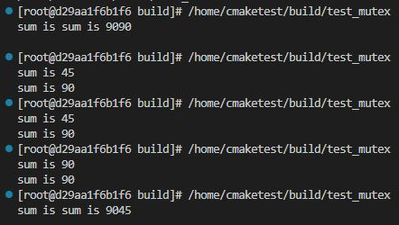

# 併發相關 mutex

今天開始就來介紹跟併發相關的部分，先從`mutex`開始

## mutex

`mutex`是多執行緒中會使用到的功能，能針對一段代碼區段上鎖，確保同一時間下只有一個執行緒能夠存取這段代碼區段

那先來看一下，如果多執行緒不上鎖會發現什麼事

```cpp
#include <iostream>
#include <thread>
#include <mutex>

using namespace std;

int g_sum = 0;

void IncrementSomething()
{
    for (size_t i = 0; i < 10; i++)
    {
        g_sum += i;
    }
    
    cout << "sum is " << g_sum << endl;
}

int main(int argc, char const *argv[])
{
    thread t1(IncrementSomething);
    thread t2(IncrementSomething);

    t1.join();
    t2.join();

    return 0;
}
```



可以看到上圖的結果，會出現順序不對的情況，那是因為沒上鎖的情況，哪個執行緒先開始做，另一個執行緒也能從中途插進去做

那現在就來看看上鎖後的情況，這邊使用lock_gurad函數來上鎖

```cpp
mutex mtx;

int g_sum = 0;

void IncrementSomething()
{
    // 透過RAII(Resource Acquisition is Iniatialization)資源獲取即初始化，當離開此區段mutex就會自動unlock
    lock_guard<mutex> lock(mtx);
    // 手動上鎖
    // mtx.lock();
    for (size_t i = 0; i < 10; i++)
    {
        g_sum += i;
    }
    
    cout << "sum is " << g_sum << endl;
    // 手動解鎖
    // mtx.unlock();
}
```

### try_lock

當`mutex`被某個線程lock住了的時候，實際上別的線程在lock時是阻塞的，而`try_lock`函數是非阻塞的，不過若`mutex`被其他線程lock住，函數會回false，不會阻塞

```cpp
void IncrementSomething()
{
    while (!mtx.try_lock())
    {
        this_thread::sleep_for(chrono::microseconds(100)); // 等100奈秒
    }

    for (size_t i = 0; i < 1000000; i++)
    {
        g_sum ++;
    }
    
    cout << "sum is " << g_sum << endl;
    mtx.unlock();
}
```

### recursive_mutex

再來看如何解決同一線程需要多次取得`mutex`而造成死鎖的問題，參考下面例子

```cpp
void Func2()
{
    lock_guard<mutex> lock(mtx); // mtx被Func1鎖住但未釋放，卡住
    cout << "hihi\n";
}

void Func1()
{
    lock_guard<mutex> lock(mtx); 
    Func2();
}

int main(int argc, char const *argv[])
{
    Func1(); // deadlock

    return 0;
}
```

這時候可以使用`recursive_mutex`來解決上面的問題

```cpp
recursive_mutex rec_mtx;
void Func2()
{
    lock_guard<recursive_mutex> lock(rec_mtx);
    cout << "hihi\n";
}

void Func1()
{
    lock_guard<recursive_mutex> lock(rec_mtx);
    Func2();
}

int main(int argc, char const *argv[])
{
    Func1(); // hihi

    return 0;
}
```

### timed_mutex

超時的`mutex`這個跟`try_lock`用法也很像，就是加上個timeout，參考下面例子

```cpp
timed_mutex time_mtx;
void work()
{
    chrono::milliseconds timeout(100);

    if (time_mtx.try_lock_for(timeout))
    {
        cout << this_thread::get_id() << ": do work with the mutex" << endl;
        chrono::milliseconds sleepDuration(250); // 讓先搶到鎖的執行緒睡到另一個執行緒timeout
        this_thread::sleep_for(sleepDuration);
        time_mtx.unlock();
    }
    else
    {
        cout << this_thread::get_id() << ": do work without the mutex" << endl;
    }
}

int main(int argc, char const *argv[])
{
    thread t1(work);
    thread t2(work);
    t1.join();
    t2.join();

    return 0;
}
```
