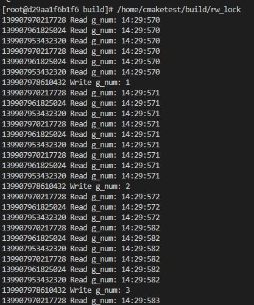

# 併發相關 讀寫鎖

昨天介紹了`mutex`，今天就來講一個`mutex`的進階`讀寫鎖`

## 讀寫鎖

讀寫鎖主要應用場景是`讀多寫少`的部分，概念是分別有用在讀共享資源的`讀鎖`，與操作共享資源的`寫鎖`，`讀鎖`能讓多個執行緒同時讀資料，而`寫鎖`是獨佔的，一次只有一個鎖可寫入，參考下面例子

```cpp
#include <iostream>
#include <thread>
#include <mutex>
#include <shared_mutex>
#include <chrono>

using namespace std;

mutex mtx;

std::string FormatTimeNow(const char* format) {
  auto now = std::chrono::system_clock::now();
  std::time_t now_c = std::chrono::system_clock::to_time_t(now);
  std::tm* now_tm = std::localtime(&now_c);

  char buf[20];
  std::strftime(buf, sizeof(buf), format, now_tm);
  return std::string(buf);
}

class RWLockNum
{
private:
    int num = 0;
    mutable shared_mutex shared_mtx; // C++17以後出的mutex，該鎖就能同時充當讀鎖與寫鎖
public:
    int Increment()
    {
        // 寫鎖，這邊用lock_guard來獨佔
        lock_guard<shared_mutex> lk(shared_mtx);
        return ++num;
    }

    int GetNum()
    {
        // 讀寫，shared_lock也是C++17之後出來搭配shared_mutex的，可以併發去讀取數據
        shared_lock<shared_mutex> lk(shared_mtx);
        return num;
    }
};

RWLockNum counter;

void WriteFunc()
{
    while (true)
    {
        this_thread::sleep_for(chrono::milliseconds(300));
        unique_lock<mutex> lock(mtx);
        cout << this_thread::get_id() << " Write g_num: " << counter.Increment() << endl;
    }
}

void ReadFunc()
{
    while (true)
    {
        this_thread::sleep_for(chrono::milliseconds(100));
        unique_lock<mutex> lock(mtx);
        cout << this_thread::get_id() << " Read g_num: " << counter.GetNum() << endl;
    }
}

int main(int argc, char const *argv[])
{
    thread t1(WriteFunc);
    thread t2(ReadFunc);
    thread t3(ReadFunc);
    thread t4(ReadFunc);

    t1.join();
    t2.join();
    t3.join();
    t4.join();

    return 0;
}
```



以上就是搭配C++17新的`mutex`的讀寫鎖例子

## 參考

[C++ 併發處理實戰](https://www.tenlong.com.tw/products/9786263240032?list_name=srh)
