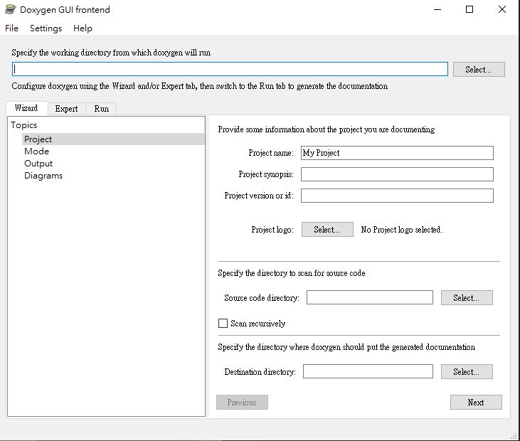
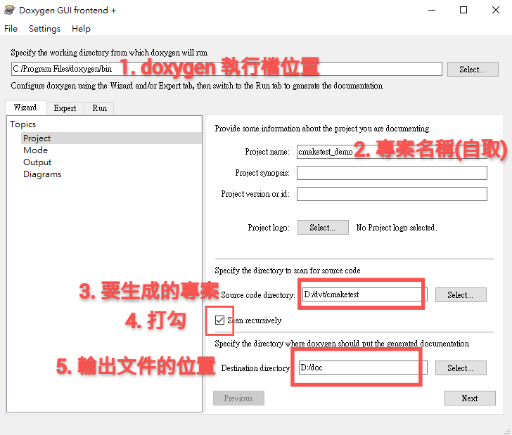
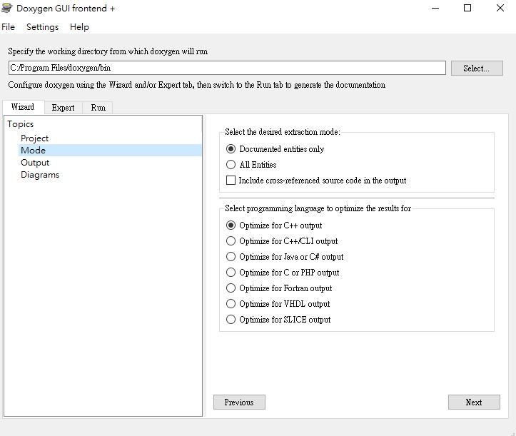
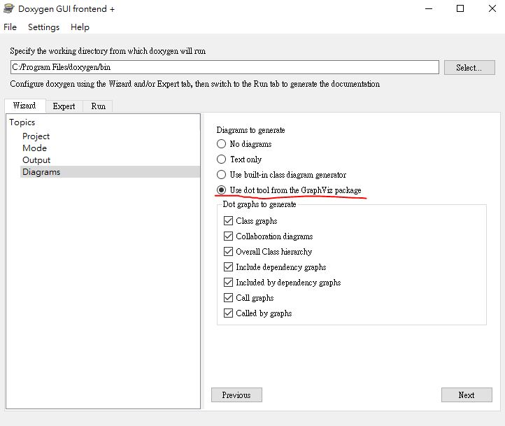
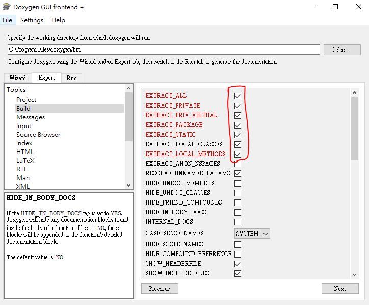
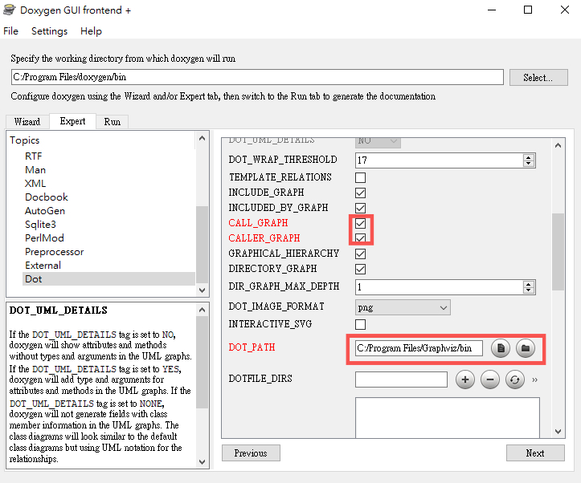
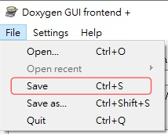
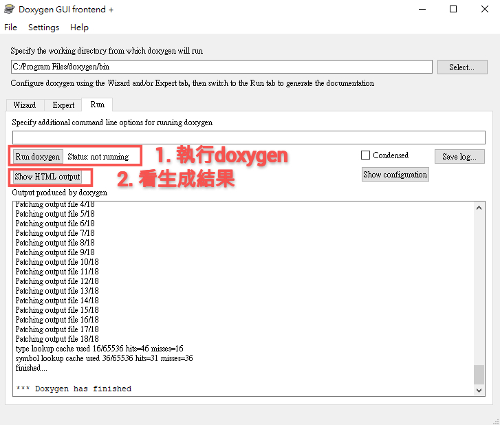
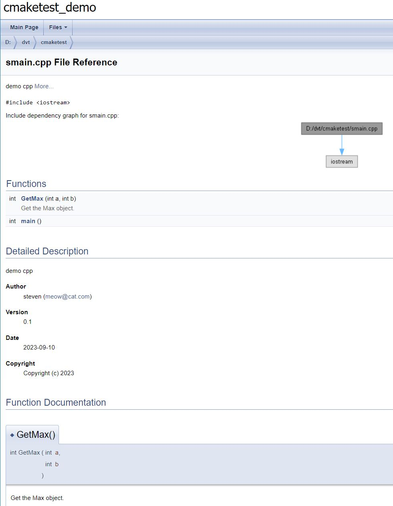
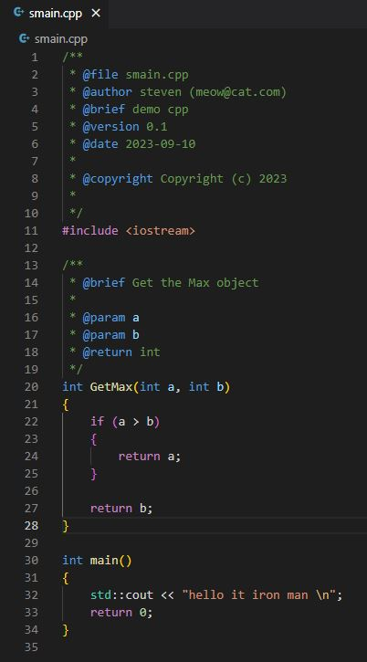

# 代碼分析工具

今天來介紹的是能根據註解來產生文件的工具以及生成程式中各個文件依賴關係圖的工具，主要目的是幫助讀代碼的人更好的去理解代碼架構。

## Doxygen

如開頭`Doxygen`就是一個能依註解產生文件的工具，那這個就直接提供[下載連結](https://www.doxygen.nl/download.html)安裝`Windows`版本，工具本身就有`GUI`，所以打開來就可以直接用，那下面會接著另一個工具的安裝，之後再看如何用。

## Graphviz

`Graphviz`是一個能將結構化信息轉成圖片的工具，其應用範圍領域涵蓋網路、生物信息、軟件工程、數據庫和網站設計等，[下載連結](https://www.graphviz.org/download/)，一樣有提供`Windows`安裝的EXE檔，下載後就可直接安裝。

## Doxygen With Graphviz

下載並安裝完兩個工具後，就可以來使用工具了。

首先，打開`Doxygenwizard`，參考下圖的幾個欄位去填上對應的設定。

Wizard - Mode中可以針對不同語言做優化

Wizard - Diagrams勾選使用Graphviz的`dot tool`選項

Expert - Build的分頁勾選紅框內的選項

Expert - Dot分頁勾選與填上紅框的選項

到這邊就基本設定完了，可以選擇儲存設置，簡化之後配置。

最後就是生成文檔與圖片了，參考下圖的指示

生成出來的內容

## VS Code Extensions

這邊再多介紹一個輔助我們寫`Doxygen`註解的套件`Doxygen Documentation Generator`，使用方式也很簡單，再文檔開頭或函式等開頭輸入`/** + enter`，就會產出對應的格式了

---

## 結尾補充

基本上這兩個套件，其實目前我並沒有用在工作上，但我覺得本質上是能幫助在看一些大些且較雜亂程式碼時會有幫助的，所以在鐵人賽這邊弄個簡易教學，提醒自己之後就其運用在工作上。

## 參考資料

[Doxygen 筆記](https://tsaiyuyan.github.io/2020/04/28/doxygen-bi-ji/)
[Doxygen + Graphviz 代码自动化分析](https://blog.csdn.net/FSKEps/article/details/125137129)
