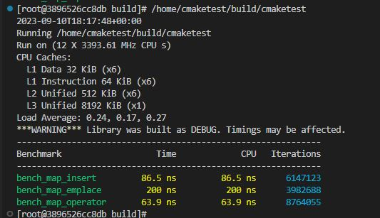

# 第三方套件 Google Benchmark

今天介紹的是測試性能的工具 - [Google benchmark](https://github.com/google/benchmark)

## 安裝

安裝的部分，就仰賴Day2介紹的[vcpkg](https://vcpkg.io/en/)來安裝，那這邊我就延續第一天的`Dockerfile`並補上安裝`vcpkg`的部分

```dockerfile
FROM centos:7

RUN yum -y update
RUN yum -y install gcc
RUN yum -y install vim

# CentOS devtoolset
RUN yum -y install centos-release-scl
RUN yum -y install devtoolset-7
RUN scl enable devtoolset-7 bash
RUN echo 'source scl_source enable devtoolset-7' >> ~/.bashrc

# CMake Insatll
WORKDIR /usr/local/src
RUN curl -LO https://github.com/Kitware/CMake/releases/download/v3.22.2/cmake-3.22.2-linux-x86_64.tar.gz
RUN tar -xvf cmake-3.22.2-linux-x86_64.tar.gz
RUN mv cmake-3.22.2-linux-x86_64 /usr/local/cmake
RUN echo 'export PATH="/usr/local/cmake/bin:$PATH"' >> ~/.bashrc

# git update version
RUN yum -y remove git
RUN yum -y install https://packages.endpointdev.com/rhel/7/os/x86_64/endpoint-repo.x86_64.rpm
RUN yum -y install git

# vcpkg
WORKDIR /opt
RUN git clone https://github.com/microsoft/vcpkg
RUN ./vcpkg/bootstrap-vcpkg.sh 
RUN echo 'export PATH="/opt/vcpkg:$PATH"' >> ~/.bashrc 
RUN source ~/.bashrc
```

重包imgae後，再將container跑起來

```shell
docker build -t cpp_dev .
docker run -v D:/dvt:/home --name=cpp_dev --tty cpp_dev
```

完成後，進到container內部裡面，別忘了要先裝一下VS Code的套件，然後就可以來安裝`benchmark`了

```shell
vcpkg install benchmark
```

安裝完應該就會看到以下信息

```shell
Stored binaries in 1 destinations in 571 ms.
Elapsed time to handle benchmark:x64-linux: 27 s
Total install time: 27 s
benchmark provides CMake targets:

    # this is heuristically generated, and may not be correct
    find_package(benchmark CONFIG REQUIRED)
    target_link_libraries(main PRIVATE benchmark::benchmark benchmark::benchmark_main)
```

## 使用

接下來一樣建個`CMake`專案來編譯我們的程式，這邊一樣用Day1的`cmaketest`專案，然後調整一下`CMakeLists.txt`以及`smain.cpp`

```CMake
cmake_minimum_required(VERSION 3.10) # 設定最低版本要求
project(cmaketest)                  # 專案名稱

set(CMAKE_CXX_COMPILER "/opt/rh/devtoolset-7/root/usr/bin/g++")
set(CMAKE_CXX_FLAGS "-std=c++14") 

set(SRC
    smain.cpp
)

find_package(benchmark CONFIG REQUIRED)

add_executable(${PROJECT_NAME} ${SRC})

target_link_libraries(${PROJECT_NAME} PRIVATE benchmark::benchmark benchmark::benchmark_main)
```

```cpp
#include <benchmark/benchmark.h>
#include <map>

static void bench_map_insert(benchmark::State& state)
{
    std::map<int, int> mmap;
    for (auto _ : state) {
        // This code gets timed
        mmap.insert(std::make_pair(5,15));
    }
}

BENCHMARK(bench_map_insert);

static void bench_map_emplace(benchmark::State& state)
{
    std::map<int, int> mmap;
    for (auto _ : state) {
        // This code gets timed
        mmap.emplace(5, 15);
    }
}

BENCHMARK(bench_map_emplace);

static void bench_map_operator(benchmark::State& state)
{
    std::map<int, int> mmap;
    for (auto _ : state) {
        // This code gets timed
        mmap[5] = 15;
    }
}

BENCHMARK(bench_map_operator);

BENCHMARK_MAIN();
```

然後再使用`CLI`設定CMake專案，`cmake -B build -S . -DCMAKE_TOOLCHAIN_FILE=/opt/vcpkg/scripts/buildsystems/vcpkg.cmake`，設定完後執行，就能看到結果了



## 結語

以上就是一個簡單的benchmark範例，實務上針對一些函式性能的驗證是很好用的，其中還有一些更細的操作，但目前我碰觸到的範圍窄，就沒有太深入研究了，另外上面的CMake專案一樣會同步到我的[GitHub](https://github.com/steven715/15-IT-IronMan/tree/master)上的`Day4`中，懶得複製貼上可以直接去抓下來跑。

## 參考

[C++服务性能优化的道与术-道篇：google benchmark的安装与使用](https://cloud.tencent.com/developer/article/1914993)
