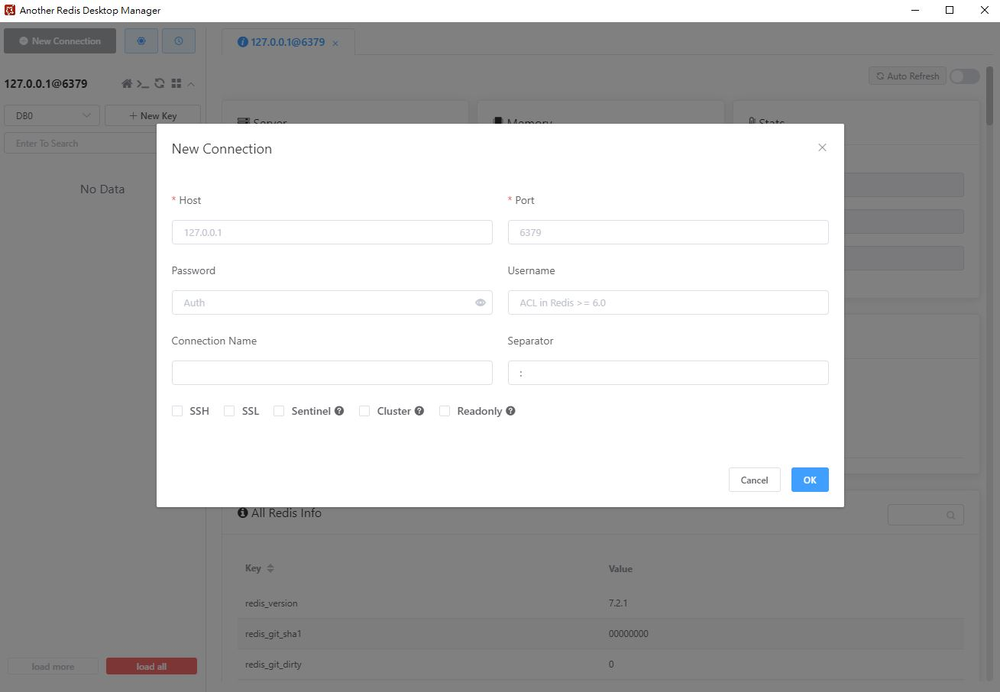

# 第三方套件 hiredis

今天要來介紹如何透過C++連線到`redis`，`redis`是`key-value`的資料庫，常用於快取。

## 環境

這次的環境除了一樣的`Dockerfile`外，還要來透過`Docker`建一個`redis`資料庫。

```shell
docker run --name redis-lab -p 6379:6379 -d redis
docker run -v D:/dvt:/home --name=cpp_dev --tty cpp_dev
```

上面都跑好後，透過一個Redis管理工具([AnotherRedisDesktopManager](https://github.com/qishibo/AnotherRedisDesktopManager/releases))來連線測試有沒有建成功。



## 安裝

安裝一樣靠`vcpkg`

```shell
vcpkg install hiredis
# 完成信息
hiredis provides CMake targets:

    # this is heuristically generated, and may not be correct
    find_package(hiredis CONFIG REQUIRED)
    target_link_libraries(main PRIVATE hiredis::hiredis)
```

## 使用

這邊就用個簡單的字串範例做DEMO，參考以下代碼

```cpp
#include <stdio.h>
#include <stdlib.h>
#include <string.h>
#include <hiredis/hiredis.h>
int main(int argc, char **argv)
{
    unsigned int j;
    redisContext *conn;
    redisReply *reply;
    if (argc < 2)
    {
        printf("Usage: example {instance_ip_address} 6379\n");
        exit(0);
    }
    const char *hostname = argv[1];
    const int port = atoi(argv[2]);
    conn = redisConnect(hostname, port);
    if (conn == NULL || conn->err)
    {
        if (conn)
        {
            printf("Connection error: %s\n", conn->errstr);
            redisFree(conn);
        }
        else
        {
            printf("Connection error: can't allocate redis context\n");
        }
        exit(1);
    }

    /* Set */
    reply = (redisReply *)redisCommand(conn, "SET %s %s", "welcome", "Hello, DCS for Redis!");
    printf("SET: %s\n", reply->str);
    freeReplyObject(reply);

    /* Get */
    reply = (redisReply *)redisCommand(conn, "GET welcome");
    printf("GET welcome: %s\n", reply->str);
    freeReplyObject(reply);

    /* Disconnects and frees the context */
    redisFree(conn);
    return 0;
}
```

然後再補上`CMakeLists.txt`跟`cmake -B build -S . -DCMAKE_TOOLCHAIN_FILE=/opt/vcpkg/scripts/buildsystems/vcpkg.cmake`

```cmake
cmake_minimum_required(VERSION 3.10) # 設定最低版本要求
project(cmaketest)                  # 專案名稱

set(CMAKE_CXX_FLAGS "-std=c++14") 

set(SRC
    smain.cpp
)
find_package(hiredis CONFIG REQUIRED)
add_executable(${PROJECT_NAME} ${SRC})
target_link_libraries(${PROJECT_NAME} PRIVATE hiredis::hiredis)
```

再來建置跟執行

```shell
cd build
make
./cmaketest 172.17.0.1 6379 # ip位址要用docker network的Gateway，用本機會出現Connection refused
# output
SET: OK
GET welcome: Hello, DCS for Redis!
```

## 參考

[[Redis] 使用 Docker 安裝 Redis](https://marcus116.blogspot.com/2019/02/how-to-run-redis-in-docker.html)
[[Tool] Redis 管理工具 - Another Redis Desktop Manager](https://marcus116.blogspot.com/2020/04/tool-redis-another-redis-desktop-manager.html)
