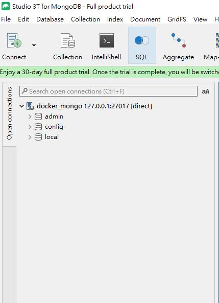
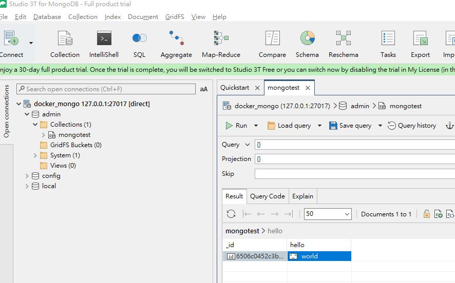

# 第三方套件 mongocxx

今天來介紹`mongodb`的C++客戶端函式庫，該函式庫也是`mongodb`官方提供的開源函式庫。

## 環境

環境因安裝`mongodb`會需要額外依賴，所以有補上了相關依賴，可以[這邊]()找到，也需要建一個`mongodb`的容器

```shell
docker run -itd --name mongo -p 27017:27017 mongo
docker run -v D:/dvt:/home --name=cpp_dev --tty cpp_dev
```

建好`mongodb`後，一樣透過一個GUI工具([studio 3t](https://studio3t.com/), [dbeaver](https://dbeaver.io/)推薦這兩款，擇一安裝即可)來連看看有沒有建成功。



## 安裝

安裝也是老樣子，`vcpkg`搞定

```shell
vcpkg install mongo-cxx-driver
# 安裝完成信息
mongo-cxx-driver provides CMake targets:

    find_package(bsoncxx CONFIG REQUIRED)
    target_link_libraries(main PRIVATE $<IF:$<TARGET_EXISTS:mongo::bsoncxx_static>,mongo::bsoncxx_static,mongo::bsoncxx_shared>)

    find_package(mongocxx CONFIG REQUIRED)
    target_link_libraries(main PRIVATE $<IF:$<TARGET_EXISTS:mongo::mongocxx_static>,mongo::mongocxx_static,mongo::mongocxx_shared>)
```

## 使用

範例代碼就參考下方

```cpp
#include <string>
#include <vector>
#include <iostream>
#include <bsoncxx/json.hpp>
#include <mongocxx/client.hpp>
#include <mongocxx/instance.hpp>
#include <bsoncxx/builder/stream/document.hpp>

using namespace std;

// Create a new collection in the given database.
void createCollection(mongocxx::database& db, const string& collectionName)
{
 db.create_collection(collectionName);
}
// Create a document from the given key-value pairs.
bsoncxx::document::value createDocument(const vector<pair<string, string>>& keyValues)
{
 bsoncxx::builder::stream::document document{};
 for (auto& keyValue : keyValues)
 {
  document << keyValue.first << keyValue.second;
 }
 return document << bsoncxx::builder::stream::finalize;
}
// Insert a document into the given collection.
void insertDocument(mongocxx::collection& collection, const bsoncxx::document::value& document)
{
 collection.insert_one(document.view());
}

// Print the contents of the given collection.
void printCollection(mongocxx::collection& collection)
{
 // Check if collection is empty.
 if (collection.count_documents({}) == 0)
 {
  cout << "Collection is empty." << endl;
  return;
 }
 auto cursor = collection.find({});
 for (auto&& doc : cursor)
 {
  cout << bsoncxx::to_json(doc) << endl;
 }
}
// Find the document with given key-value pair.
void findDocument(mongocxx::collection& collection, const string& key, const string& value)
{
 // Create the query filter
 auto filter = bsoncxx::builder::stream::document{} << key << value << bsoncxx::builder::stream::finalize;
 //Add query filter argument in find
 auto cursor = collection.find({ filter });
 for (auto&& doc : cursor)
 {
          cout << bsoncxx::to_json(doc) << endl;
 }
}

int main()
{ 
  try
  {
    // Create an instance.
    mongocxx::instance inst{};
  
    // Replace the connection string with your MongoDB deployment's connection string.
    const auto uri = mongocxx::uri{"mongodb://172.17.0.1:27017"};
  
    // Set the version of the Stable API on the client.
    mongocxx::options::client client_options;
    const auto api = mongocxx::options::server_api{ mongocxx::options::server_api::version::k_version_1 };
    client_options.server_api_opts(api);
  
    // Setup the connection and get a handle on the "admin" database.
    mongocxx::client conn{ uri, client_options };
    mongocxx::database db = conn["admin"];
    
    // Ping the database.
    const auto ping_cmd = bsoncxx::builder::basic::make_document(bsoncxx::builder::basic::kvp("ping", 1));
    db.run_command(ping_cmd.view());
    std::cout << "Pinged your deployment. You successfully connected to MongoDB!" << std::endl;

    // create data
    createCollection(db, "mongotest");
    auto collection = db.collection("mongotest");
    vector<pair<string, string>> datas = { {"hello","world"} };
    auto documnet = createDocument(datas);
    insertDocument(collection, documnet);

    // read data
    printCollection(collection);
  }
  catch (const std::exception& e) 
  {
    // Handle errors.
    std::cout<< "Exception: " << e.what() << std::endl;
  }

  return 0;
}
```

然後是`CMakeLists.txt`跟`cmake -B build -S . -DCMAKE_TOOLCHAIN_FILE=/opt/vcpkg/scripts/buildsystems/vcpkg.cmake`

```cmake
cmake_minimum_required(VERSION 3.10) # 設定最低版本要求
project(cmaketest)                  # 專案名稱

set(CMAKE_CXX_FLAGS "-std=c++17") # mongocxx 需要C++ 17版本

set(SRC
    smain.cpp
)

find_package(bsoncxx CONFIG REQUIRED)
find_package(mongocxx CONFIG REQUIRED)
add_executable(${PROJECT_NAME} ${SRC})
target_link_libraries(${PROJECT_NAME} PRIVATE $<IF:$<TARGET_EXISTS:mongo::bsoncxx_static>,mongo::bsoncxx_static,mongo::bsoncxx_shared>)
target_link_libraries(${PROJECT_NAME} PRIVATE $<IF:$<TARGET_EXISTS:mongo::mongocxx_static>,mongo::mongocxx_static,mongo::mongocxx_shared>)
```

最後是建置與執行，執行完也能從GUI工具中看到資料是否成功存入DB

```shell
cd build
make
./cmaketest
# output
Pinged your deployment. You successfully connected to MongoDB!
{ "_id" : { "$oid" : "6506c0452c3b81a5550c0e21" }, "hello" : "world" }
```



## 參考

[Getting Started with MongoDB and C++](https://www.mongodb.com/developer/products/mongodb/getting-started-mongodb-cpp/)
